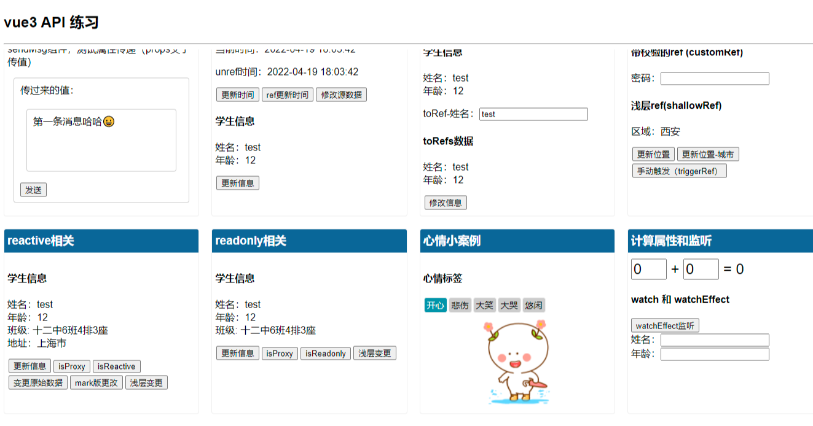

# vue3 响应式 API 练习

## Project setup

```
yarn install
```

### Compiles and hot-reloads for development

```
yarn serve
```

### Compiles and minifies for production

```
yarn build
```

### Lints and fixes files

```
yarn lint
```

### 在新预览



https://csb-hvnb2s.netlify.app/

### Customize configuration

See [Configuration Reference](https://cli.vuejs.org/config/).
